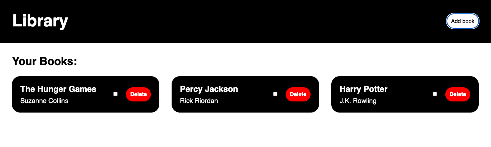

# Library 📚

A browser-based Library app built with HTML, CSS, and JavaScript as part of 
The Odin Project. Implements a custom `Book` constructor, object-oriented data 
handling, dynamic card rendering, and a modal form for input.

## 🚀 Try it out


[🔗 View Live](https://theamanali.github.io/library)
## ✨ Features

- Add new books via a modal dialog (title, author, “have you read it?”, unique ID)
- Display each book as a card in a responsive grid
- Toggle a book’s read status with a checkbox
- Delete individual books from the library
- Show placeholder text when no books are in the library

### To add

- Persist data in `localStorage` so entries survive page reloads
- Search or filter books
- Responsive tweaks for mobile

## 🛠️ Installation

To run locally (using SSH):

```bash
git clone git@github.com:theamanali/library-app.git
cd library-app
open index.html
```
Or, after cloning, simply open index.html in your browser!

## 🧰 Technologies Used
- HTML
- CSS
- JavaScript

## 💳 Credits
- The Odin Project, for the project specification

## 📄 License

This project is licensed under the MIT License.  